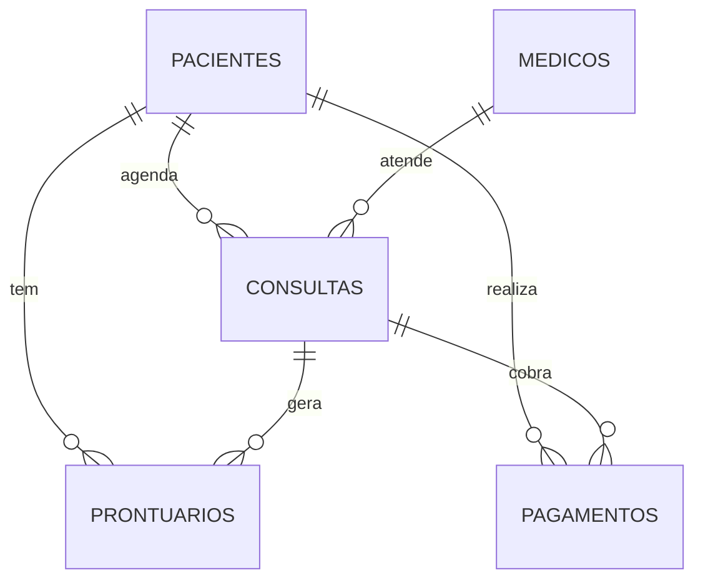

# ClinicaMed – Sistema de Gestão de Clínica Médica

Aplicação Java (console) + MySQL via JDBC para gerenciar pacientes, médicos, funcionários, consultas, prontuários e pagamentos, com login obrigatório.

## Requisitos atendidos
| Requisito | Onde |
|---|---|
| Cadastro de pacientes, médicos e funcionários | menus Pacientes / Médicos / Funcionários (CRUD) |
| Agendamento de consultas e prontuários | menus Consultas / Prontuários (CRUD) |
| Acesso só com login | `Auth.autenticar` – paciente e funcionário entram com **CPF**, médico com **CRM**, mais senha (SHA-256) |
| Quem não tem acesso é cadastrado | opção "Cadastrar-se" (paciente); funcionários cadastram médicos e outros funcionários já com senha |

## Perfis e permissões
| Perfil | Pode |
|---|---|
| FUNCIONARIO | CRUD de pacientes, médicos, funcionários, consultas, prontuários e pagamentos |
| MEDICO | listar pacientes, ver e confirmar/cancelar **suas** consultas, CRUD dos prontuários das **suas** consultas |
| PACIENTE | ver seus dados, solicitar consulta (fica `pendente`), cancelar e ver **suas** consultas, ver **seus** prontuários e pagamentos |

## Como executar
1. JDK 17+, Maven e MySQL 8+.
2. Crie o banco: `mysql -u root -p < sql/clinicamed.sql`
   (se o banco já existir: `DROP DATABASE ClinicaMed;` antes).
3. Configure a conexão (padrão: `root`, senha vazia, `localhost:3306`):
   ```bash
   export CLINICA_DB_USER=root
   export CLINICA_DB_PASS=sua_senha
   ```
4. Rode: `mvn -q compile exec:java`
5. Primeiro acesso: **Funcionário** → CPF `000.000.000-00` / senha `admin123` (cadastre seu usuário e troque).

## Diagrama de casos de uso
Imagem: `diagramas/casos-de-uso.png`. Fonte editável: `diagramas/casos-de-uso.puml` (PlantUML).

## Modelo de dados (DER)


## Estrutura
```
sql/clinicamed.sql            script do banco (+ funcionário inicial)
src/main/java/clinicamed/     Main, Auth, Crud, Regras, Conexao, Sessao
diagramas/                    casos de uso (PNG + PlantUML)
```

## Regras implementadas no Java (o esquema não as garante)
- CPF único em pacientes e em funcionários; CRM único em médicos (login depende disso).
- Médico não pode ter duas consultas (não canceladas) no mesmo horário.
- Prontuário e pagamento só aceitam consulta que pertença ao paciente informado.
- Campos `NOT NULL` são exigidos no cadastro; todas as consultas SQL usam `PreparedStatement`.
- Excluir registro com vínculos (ex.: paciente com consultas) é bloqueado pelas chaves estrangeiras.

## Melhorias futuras
`UNIQUE` em `cpf`/`crm` no banco, BCrypt no lugar de SHA-256, interface JavaFX, relatórios e testes automatizados.
